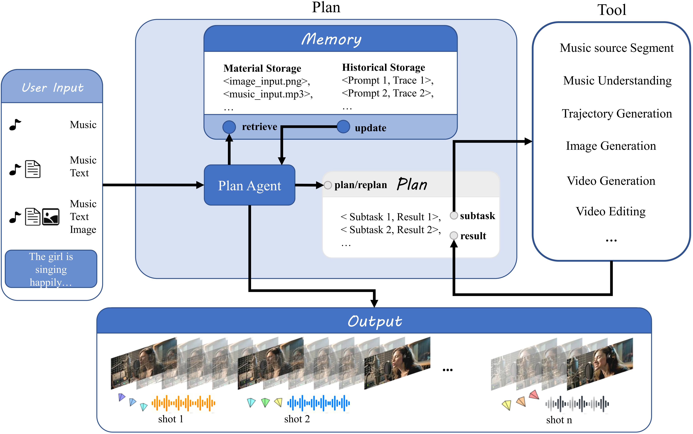
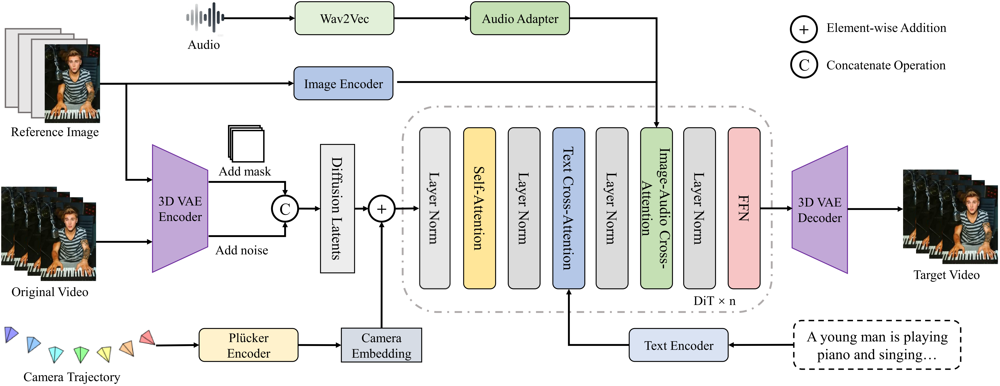

# YingVideo-MV: Music-Driven Multi-Stage Video Generation


<div align="center">

[](tech_report/YingVideo-MV-Tech_Report.pdf)
[](https://giantailab.github.io/YingVideo-MV/)


</div>


## 🎬 Introduction Video

https://github.com/user-attachments/assets/ab778888-8a1d-4480-b0a2-c8f9136e9da1


---

## Overview ✨

<p align="center">
  
</p>

 We present YingVideo-MV, the first cascaded framework for music-driven long-video generation. Our approach integrates audio semantic analysis, an interpretable shot planning module (MV-Director), temporal-aware diffusion Transformer architectures, and long-sequence consistency modeling to enable automatic synthesis of high-quality music performance videos from audio signals. We construct a large-scale Music-in-the-Wild Dataset by collecting web data to support the achievement of diverse, high-quality results. Observing that existing long-video generation methods lack explicit camera motion control, we introduce a camera adapter module that embeds camera poses into latent noise. To enhance continulity between clips during long-sequence inference, we further propose a time-aware dynamic window range strategy that adaptively adjust denoising ranges based on audio embedding. Comprehensive benchmark tests demonstrate that YingVideo-MV achieves outstanding performance in generating coherent and expressive music videos, and enables precise audio-motion-camera synchronization.


### 🔧 Key Features  
- **Cascaded Training Pipeline**  
  - **Camera Control**: Camera Adapter with Explicit Camera Control  
  - **TDW**: Timestep-aware Dynamic Window Range Strategy 
  - **RL (DPO)**: Multi-reward Reinforcement Learning for Human Preferences 

---


<p align="center">
  
</p>

---

## News & Updates 🗞️
- **2025-11-27**: Released technical report

---

## Development Roadmap & TODO 🗺️
- [ ] inference code in mid-December
- [ ] 1.3B model checkpoint in mid-December


<!-- [//]: # (## Acknowledgements 🙏  )

[//]: # (This project is built upon:)

[//]: # (- Seed-VC &#40;DiT + Flow Matching&#41;)

[//]: # (- BigVGAN Vocoder  )

[//]: # (- FireRedASR  )

[//]: # (- Audiobox Aesthetics  )

[//]: # () -->
[//]: # (---)

[//]: # ()
[//]: # ()
[//]: # (## Citation 🧾)

[//]: # ()
[//]: # (If you use YingVideo-MV for research, please cite:)

[//]: # ()
[//]: # (```)

[//]: # (@article{yingvideo_smv_2025,)

[//]: # (  title={YingVideo-MV: Agent-Based Music-Driven Video Generation},)

[//]: # (  author={Giant AI Lab},)

[//]: # (  year={2025})

[//]: # (})

[//]: # (```)

---

## License 📝  
Our code is released under MIT License.
